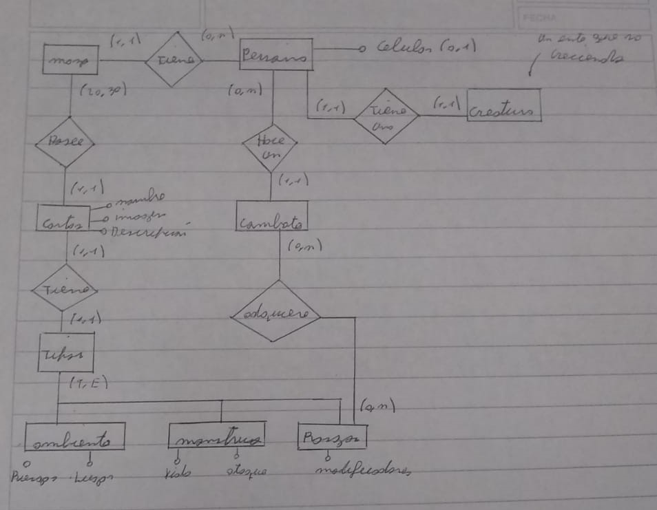

# 👽 Cuestion de espacio

## Reglas
- Jugar una carta por turno
- Se juego con dos jugadores (modo duelo)
- Al que gana en el duelo, se gana un rasgo

## Cartas

- Rata
    - Ataque : 
    - Vida :
- Humano
    -  Vive
- Hongos
    - Resiste

## Plantillas

<table>
<tr>
<td> Rasgos</td> <td> Mounstros </td><td> Ambientes </td>
</tr><tr><td>

</td><td>

 
</td><td>
 

 
</td></tr></table>

### Diagrama de flujo utilizado

## Pasos
- Con qr voy a la direccion de la carta. Ejemplo www.Cuestion-De-Espacio.com/Cartas/001
- Aca tenemos la plantilla que corresponde a su carta. (esta vacia)
- La web tiene que saber que cuando viene un usuario, tengo que pedir los datos al backend. Nos dirigue a otro repo por ejemplo. www.baseDeDatosCartas.com/cartas/001
- Busca en el jason del punto anterior.
- Una vez que tengo los datos los aplico a la plantilla.

